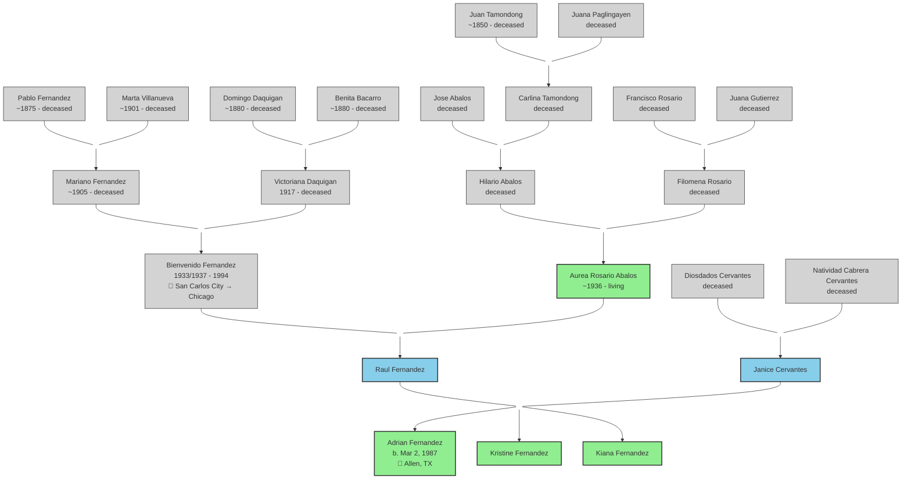

# Fernandez-Cervantes Family Tree

## Legend
- 🟢 Green = Living
- ⬜ Gray = Deceased  
- 🔵 Blue = Parents (status unknown)
- 📍 = Known locations

## Key Dates
| Person | Event | Date | Location |
|--------|-------|------|----------|
| Bienvenido & Aurea | Marriage | Dec 16, 1963 | San Carlos City, Pangasinan |
| Bienvenido | Death | 1994 | Chicago, IL |
| Adrian | Birth | Mar 2, 1987 | — |

## Confirmed by Records
- ✅ Bienvenido's parents: Mariano Fernandez & Victoriana Daquigan (FamilySearch marriage record)
- ✅ Aurea's parents: Hilario Abalos & Filomena Rosario (FamilySearch marriage record)
- ✅ Marriage location: San Carlos City, Pangasinan (FamilySearch)
- ⬜ Cervantes side: needs research
